- [Python collection types](#python-collection-types)
  - [List](#list)
  - [Set](#set)
  - [Tuple](#tuple)
  - [Dictionary](#dictionary)
- [Numpy array](#numpy-array)
  - [Anatomy of Numpy array](#anatomy-of-numpy-array)
  - [Create](#create)
    - [From python data types](#from-python-data-types)
    - [From Numpy functions](#from-numpy-functions)
    - [From special functions](#from-special-functions)
  - [Vectorization and broadcasting](#vectorization-and-broadcasting)
  - [Element-wise operations](#element-wise-operations)
    - [Arithmatic operations](#arithmatic-operations)
    - [Trigonomic functions](#trigonomic-functions)
    - [Rounding functions](#rounding-functions)
    - [Exponent and logarithm](#exponent-and-logarithm)
    - [Miscellaneous functions](#miscellaneous-functions)
  - [Indexing and slicing](#indexing-and-slicing)
    - [One dimension array](#one-dimension-array)
    - [Multi-dimension array](#multi-dimension-array)
    - [Mask indexing](#mask-indexing)
    - [Numpy indexing function](#numpy-indexing-function)
  - [Array iteration](#array-iteration)
  - [Copying numpy array](#copying-numpy-array)
    - [Shallow copy](#shallow-copy)
    - [Deep copy](#deep-copy)
  - [Array manipulation](#array-manipulation)
- [Statistics](#statistics)
    - [Random numbers](#random-numbers)

## Python collection types

### List
```Python
# List data structure
list = [1,2,3,4]
print(f'List data structue example\n{list}')
```
### Set
```Python
# Set data structure : duplicate values are not allowed
set = {1,2,3,3}
print(f'Set data structue example\n{set}')
```
### Tuple
```Python
# Tuple data structure
tuple = (1,2)
print(f'Tuple data structue example\n{tuple}')
tuple = ("a", "b", "c")
print(f'Tuple data structue example\n{tuple}')
```
### Dictionary
Fast search data structure
```Python
# Dictionary data strucrure : Key:Value
dict = {"a":1, "b":2, "book":3}
print(f'dictionary data structure example \n {dict}')
```

## Numpy array
Numpy arrays are tensors. Rank of tensors == number of indices.
- Rank = 0 : Scalar
- Rank = 1 : Array
  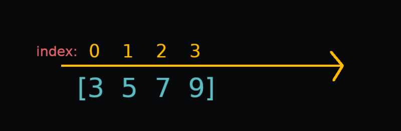
- Rank = 2 : Matrix
  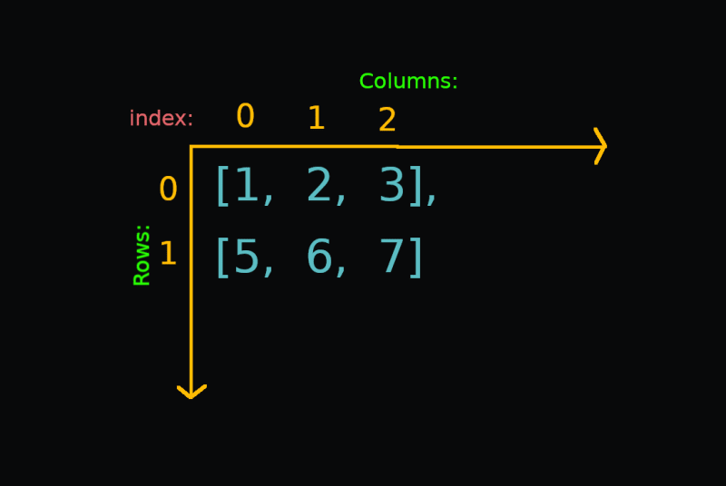
- Rank = 3 : 3D Tensor
  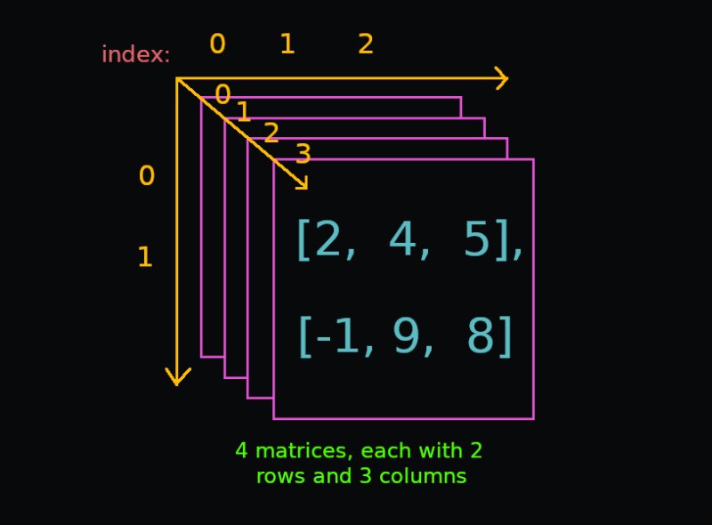
- Rank = 4 : 4D Tensor
  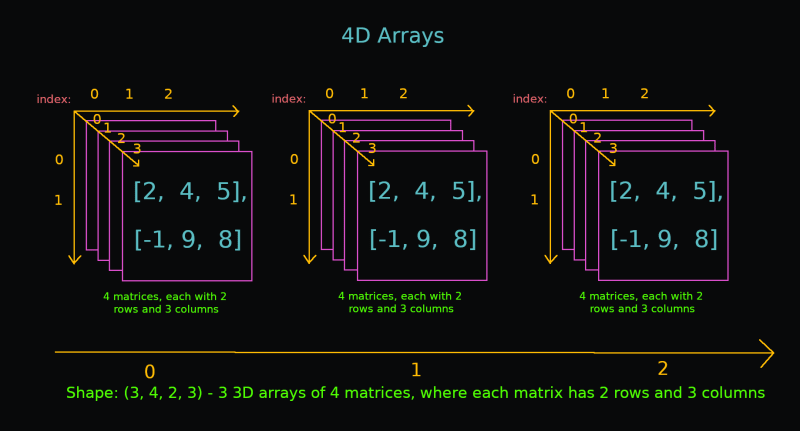
- ....

### Anatomy of Numpy array
- Shape
- Size
- Axis
- Data type

```Python
three_dim=np.array([
    [
        [1,2,3,4],
        [6,7,8,9]
    ],
    [
        [1,2,3,4],
        [6,7,8,9]
    ],
    [
        [1,2,3,4],
        [6,7,8,9]
    ]

])
print(f'two dimension array:\n{three_dim}')


array = three_dim
print(f'Shape: {array.shape}')
print(f'Number of axis: {array.ndim}')
print(f'Size: {array.size}')
print(f'Data type: {array.dtype}')
```

### Create
#### From python data types
```Python
array_list = np.array([1, 2, 3])
array_tuple = np.array(((1, 2, 3), (4, 5, 6)))
array_set = np.array({"pikachu", "snorlax", "charizard"})
```

#### From Numpy functions
```Python
# zeros
zeros = np.zeros(5)
# ones
ones = np.ones((3, 3))
# arange
arange = np.arange(1, 10, 2)
# empty
empty =  np.empty([2, 2])
# linspace
linespace = np.linspace(-1.0, 1.0, num=10)
# full
full = np.full((3,3), -2)
# indices
indices =  np.indices((3,3))
```

#### From special functions
```Python
# diagonal array
diagonal = np.diag([1, 2, 3], k=0)
# identity 
identity = np.identity(3)
# eye
eye = np.eye(4, k=1)
# rand
rand = np.random.rand(3,2)
```

### Vectorization and broadcasting
Numpy arrays operations are way faster than python loops, because of vectorized operations.
```Python
import timeit
def vectorizations_vs_python_loops():
    x = np.random.rand(100)
    y = np.random.rand(100)
    start = timeit.default_timer()
    for i in range(0, len(x)):
        x[i] + y[i]

    time1 = timeit.default_timer() - start
    print(f'Time for addition of 2 arrays using python loop is : {time1}')

    start = timeit.default_timer()
    x+y
    time2 = timeit.default_timer() - start
    print(f'Time for addition of 2 arrays using numpy vectorization loop is : {time2}')
    print(f'Vectorization is {time1/time2} times faster than for loop')
```

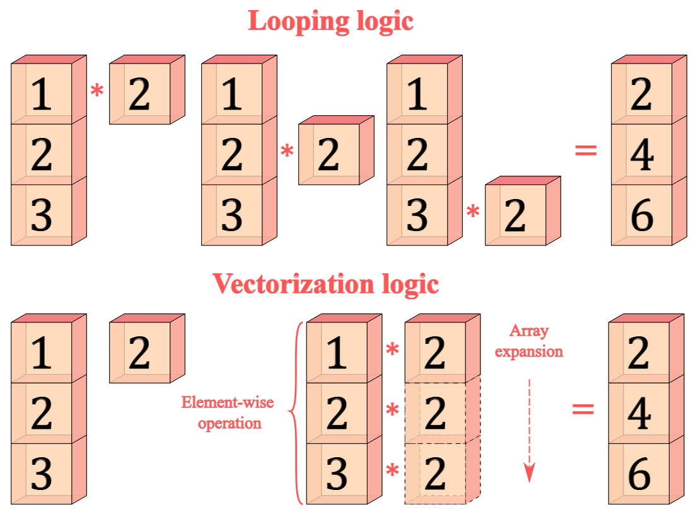
The term broadcasting describes how NumPy treats arrays with different shapes during arithmetic operations. Subject to certain constraints, the smaller array is “broadcast” across the larger array so that they have compatible shapes.

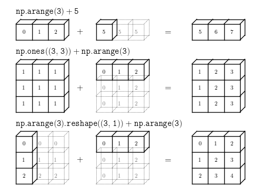

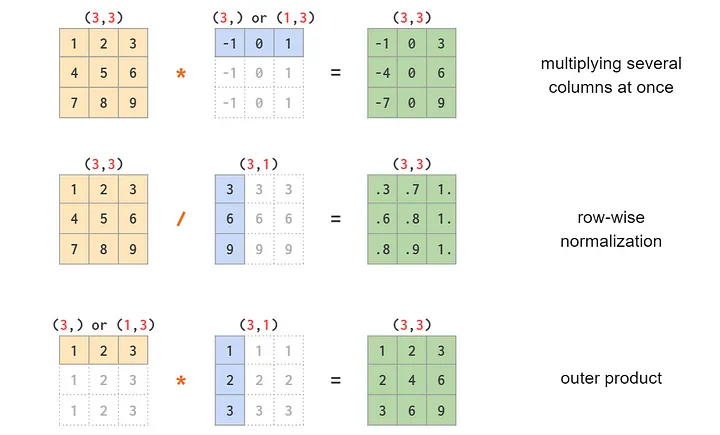


### Element-wise operations
#### Arithmatic operations
```Python
def arithmatic_operations():
    a = np.arange(1, 10).reshape((3,3))
    b = np.arange(10,19).reshape((3,3))

    addition = a + b
    subtraction = a - b
    multiplication = a * b
    true_division = a / b
    floor_division = a // b
    remainder = np.remainder(a, b) 
    array_scalar = a * 2

    print(f'array1 :\n {a}')
    print(f'array1 :\n {b}')
    print(f'addition = a + b :\n {addition}')
    print(f'subtraction = a - b :\n {subtraction}')
    print(f'multiplication = a * b :\n {multiplication}')
    print(f'true_division = a / b :\n {true_division}')
    print(f'floor_division = a // b :\n {floor_division}')
    print(f'remainder = np.remainder(a, b) :\n {remainder}')
    print(f'scalar array multiplication (array1) = a * 2 :\n {array_scalar}')
```
#### Trigonomic functions
```Python
import matplotlib.pylab as plt
def trigonomic_functions():
    x = np.linspace(-4, 4, 200)
    # sin function
    sin = np.sin(x)
    # cosine function
    cos = np.cos(x)
    # tangent function
    tan = np.tan(x)
    y = np.linspace(-4, 4, 200)
    # sin hyperbolic function
    sinh = np.sinh(y)
    # cosine hyperbolic function
    cosh = np.cosh(y)
    # tangent hyperbolic function
    tanh = np.tanh(y)

    print(f'x:\n {x}')
    print(f'sin:\n {sin}')
    print(f'cos:\n {cos}')
    print(f'tan:\n {tan}')
    print(f'y:\n {y}')
    print(f'sinh:\n {sinh}')
    print(f'cosh:\n {cosh}')
    print(f'tanh:\n {tanh}')

    plt.style.use('dark_background')
    # %config InlineBackend.figure_format = 'retina' # to get high resolution images
    fig, (ax1, ax2, ax3) = plt.subplots(3, 1)
    ax1.plot(x, sin)
    ax1.set_title("sin")
    ax2.plot(x, cos)
    ax2.set_title("cos")
    ax3.plot(x, tan)
    ax3.set_title("tan")
    plt.tight_layout()
    plt.show()
```
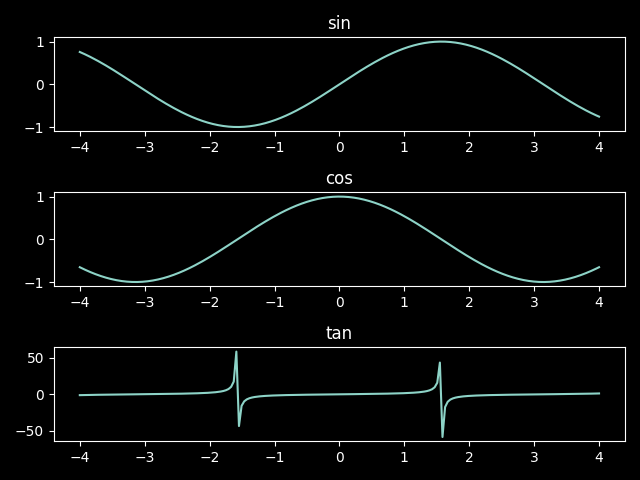


#### Rounding functions
```Python
def rounding_functions():
    decimals = np.linspace(0.11111111, 0.99999999, 10)

    # rounding
    around = np.around(decimals, 3)
    # rounding
    round = np.round(decimals, 3)
    # rounding to integer
    rint = np.rint(decimals)
    # rounding integer towards zero
    fix = np.fix(decimals)
    # round to the floor
    floor = np.floor(decimals)
    # round to the ceiling
    ceil = np.ceil(decimals)

    print(f'around: {around}')
    print(f'round: {round}')
    print(f'rint: {rint}')
    print(f'fix: {fix}')
    print(f'floor: {floor}')
    print(f'ceil: {ceil}')
```


#### Exponent and logarithm
```Python
def exponent_logarithm():
    x = np.array([0.1, 1, np.e, np.pi])

    # exponent
    exp = np.exp(x)
    # exponent(x) -1
    expm1 = np.expm1(x)
    # 2^P
    exp2 = np.exp2(x)
    # natural log
    log = np.log(x)
    # log base 10
    log10 = np.log10(x)
    # log base 2
    log2 = np.log2(x)

    print(f'exp: {exp}')
    print(f'expm1: {expm1}')
    print(f'exp2: {exp2}')
    print(f'log: {log}')
    print(f'log10: {log10}')
    print(f'log2: {log2}')

    plt.style.use('dark_background')
    # %config InlineBackend.figure_format = 'retina' # to get high resolution images
    fig, (plot1, plot2, plot3) = plt.subplots(3, 1)
    plot1.plot(x, exp)
    plot1.set_title("exp")
    plot2.plot(x, log)
    plot2.set_title("log")
    plot3.plot(x, exp2)
    plot3.set_title("exp2")
    plt.tight_layout()
    plt.show()
```
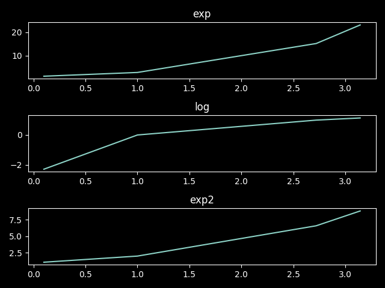


#### Miscellaneous functions
```Python
def miscellaneous_functions():
    array_1 = np.arange(-9,9, 2)
    array_2 = np.arange(-9,9, 2).reshape((3,3))

    # sum over
    sum_1, sum_2, sum_3 = np.sum(array_1), np.sum(array_2, axis=0), np.sum(array_2, axis=1) 
    # take product
    prod_1, prod_2, prod_3 = np.prod(array_1), np.prod(array_2, axis=0), np.prod(array_2, axis=1)
    # cumulative sum
    cumsum_1, cumsum_2, cumsum_3 = np.cumsum(array_1), np.cumsum(array_2, axis=0), np.cumsum(array_2, axis=1)
    # clip values
    clip_1, clip_2 = np.clip(array_1, 2, 8), np.clip(array_2, 2, 8)
    # take absolute
    absolute_1, absolute_2 = np.absolute(array_1), np.absolute(array_2) 
    # take square root
    sqrt_1, sqrt_2 = np.sqrt(np.absolute(array_1)), np.sqrt(np.absolute(array_2)) 
    # take the square power
    square_1, square_2 =  np.square(array_1), np.square(array_2)
    # sign function
    sign_1, sign_2 = np.sign(array_1), np.sign(array_2)
    # n power
    power = np.power(np.absolute(array_1), np.absolute(array_1))
```

### Indexing and slicing
#### One dimension array
```Python
def indexing_and_slicing_one_dimension_array():
    array_one = np.arange(1,11)
    print(f'Array one: {array_one}')
    print(f'Array one dimensions: {array_one.ndim}, shape:{array_one.shape}')
    print(f'Select element at position [0]: {array_one[0]}')
    print(f'Select element at position [5]: {array_one[5]}')
    print(f'Select element at position [9]: {array_one[9]}')
    print(f'Select element at position [-5]: {array_one[-5]}')
    print(f'Select element at position [-1]: {array_one[-1]}')
    # Slicing in one dimensional array
    print(f'Elements from position [0] to position [3]: {array_one[0:3]}')
    print(f'Elements from position [5] to position [9]: {array_one[5:9]}')
    print(f'Elements from position [-9] to position [-5]: {array_one[-9:-5]}')
    print(f'Elements from position [-3] to position [-1]: {array_one[-3:-1]}')
    print(f'Elements from position [3] to position [-1]: {array_one[3:-1]}')
    # slice with stride
    print(f'Slice from position [0] to position [6] with stride [1]: {array_one[0:6:1]}')
    print(f'Slice from position [0] to position [6] with stride [2]: {array_one[0:6:2]}')
    print(f'Slice from position [-6] to position [-1] with stride [3]: {array_one[-6:-1:3]}')

```
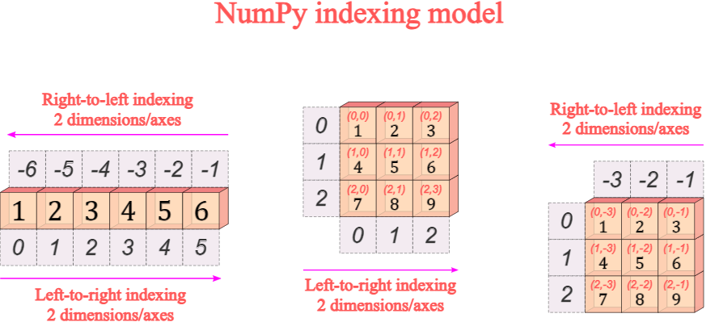

#### Multi-dimension array
There are two ways to index arrays with multiple dimensions:
- referencing each dimension/axis within a single pair of square brackets with each dimension/axis separated by commas [,]: This creates a view of original with no additional memory 
- referencing each dimension independently with as many square brackets as dimensions/axes [][]: It creates a new array with additional memory. Use it if you do not need original array and want to discard it.
```Python
def indexing_and_slicing_multi_dimension_array():
    array_two = np.arange(1,10).reshape((3,3))
    array_three = np.arange(1,9).reshape((2,2,2))
    print(f'Array two dimensions/axes: \n{array_two}\n')
    print(f'Array three dimensions/axes: \n{array_three}\n')
    print(f'Array two dimensions: {array_two.ndim}, shape:{array_two.shape}')
    print(f'Array three dimensions: {array_three.ndim}, shape:{array_three.shape}')
    # indexing: method 1
    print(f'Element at position 1 in first axis (rows) and position 1 in second axis (cols): {array_two[1,1]}')
    print(f'Element at position 0 in first axis (rows) and position 2 in second axis (cols): {array_two[0,2]}')
    print(f'Element at position -1 in first axis (rows) and position -3 in second axis (cols): {array_two[-1,-3]}')
    # indexing method 2
    print(f'Element at position 1 in first axis (rows) and position 1 in second axis (cols): {array_two[1][1]}')
    print(f'Element at position 0 in first axis (rows) and position 2 in second axis (cols): {array_two[0][2]}')
    print(f'Element at position -1 in first axis (rows) and position -3 in second axis (cols): {array_two[-1][-3]}')
    # slicing
    print(f'All elements at position 0 from first axis (all elements from first row): \n{array_two[0,:]}\n')
    print(f'All elements at position 1 from first axis (all elements from second row): \n{array_two[1,:]}\n')
    print(f'All elements at position 2 from first axis (all elements from third row): \n{array_two[2,:]}\n')
    print(f'All elements at position 0 from second axis (all elements from first  column): \n{array_two[:,0]}\n')
    print(f'All elements at position 1 from second axis (all elements from second column): \n{array_two[:,1]}\n')
    print(f'All elements at position 2 from second axis (all elements from third  column): \n{array_two[:,2]}\n')
    print(f'Elements at position 0 and 1 from first axis (rows) and position 0 from second axis (cols): \n{array_two[0:2,0]}\n')
    print(f'Elements at position 0 and 1 from first axis (rows) and position 0 and 1 from second axis (cols): \n{array_two[0:2,0:2]}\n')
    print(f'Elements at position 1 and 2 from first axis (rows) and position 1 and 2 from second axis (cols): \n{array_two[1:3,1:3]}\n')
    # slice with stride
    print(f'All elements at position 0 from first axis (all elements from first row) with stride 1: \n{array_two[0,::1]}\n')
    print(f'All elements at position 0 from first axis (all elements from first row) with stride 2: \n{array_two[0,::2]}\n')
    print(f'All elements at position 0 from second axis (all elements from first  column) with stride 1: \n{array_two[::1,0]}\n')
    print(f'All elements at position 0 from second axis (all elements from first  column) with stride 2: \n{array_two[::2,0]}\n')
    # three dimensional array
    print(f'First two-dimensional array:\n{array_three[0]}\n')
    print(f'Second two-dimensional array:\n{array_three[1]}\n')
    print(f'Elements at position 0,0,2 of 3-D array : \n{array_three[0,0,1]}\n')
    print(f'All elements at position 0 from first two-dimensional array (first row first array):\n{array_three[0][0,:]}\n')
    print(f'All elements at position 1 from second two-dimensional array (second row second array):\n{array_three[1][1,:]}\n')
```
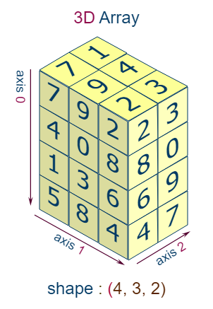

#### Mask indexing
```Python
def mask_indexing():
    # 1D
    array = np.arange(12) 
    mask = array > 6
    # Mask indexing creates a new array (new memory = deep copy)
    print(f'Array: \n{array}\n')
    print(f'Mask or Boolean arrayw with "True" for values strictly grater than 6: \n{mask}\n')
    print(f'Return an sub-array where "mask" elements are "True": \n{array[mask]}\n')

    # twoD
    array_two = np.arange(1,17).reshape((4,4))
    mask_two =  array_two > 8

    print(f'Two-dimensional array: \n{array_two}\n')
    print(f'Mask or Boolean arrayw with "True" for values strictly greater than 8: \n{mask_two}\n')
    print(f'Return an sub-array where "mask" elements are "True": \n{array_two[mask_two]}\n')
    print(f'Shape new sub-array: {array_two[mask_two].shape}')
```
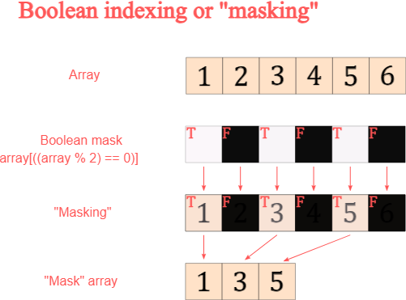


#### Numpy indexing function
```Python
def numpy_indexing_functions():
    array = np.arange(12) 
    array_two = np.arange(1,17).reshape((4,4))

    # take
    indices = [0, 2, -1]
    print(f'array is: {array}')
    print(f'Take elements at positions 0, 2 and -1 from one-dim array:\n{np.take(array, indices)}\n')
    print(f'array 2D is :\n {array_two}')
    print(f'Take elements at positions 0, 2 and -1 from one-dim array along the first (row) axis:\n{np.take(array_two, indices, axis=0)}\n')
    print(f'Take elements at positions 0, 2 and -1 from one-dim array along the second (col) axis:\n{np.take(array_two, indices, axis=1)}\n')

    # choose
    choices_one = [3, 1, 2, 0]
    choices_diagonal = [0, 1, 2, 3]
    choices_diagonal_back = [3, 2, 1, 0]


    print(f'Two-dimensional array:\n{array_two}\n')
    print(f'Choose the 1st element from the 4th array, the 2nd from the 1st, the 3th from the 2nd, and the 4th from the 1st: \n{np.choose(choices_one, array_two)}\n')
    print(f'Choose diagonal elements from top-left to botton-right: \n{np.choose(choices_diagonal, array_two)}\n')
    print(f'Choose diagonal elements from bottom-left to top-right: \n{np.choose(choices_diagonal_back, array_two)}\n')

    # diagonal
    print(f'Two-dimensional array:\n{array_two}\n')
    print(f'Extract 1st-diagonal diagonal elements from top-left to bottom-right: \n{np.diagonal(array_two, offset=0)}\n')
    print(f'Extract 2st-diagonal diagonal elements from top-left to bottom-right: \n{np.diagonal(array_two, offset=1)}\n')
    print(f'Extract 3st-diagonal diagonal elements from top-left to bottom-right: \n{np.diagonal(array_two, offset=2)}\n')

    # diagonals in the opposite direction
    print(f'Two-dimensional array\n{array_two}\n')
    print(f'Vertical flip: \n{np.flipud(array_two)}\n')
    print(f'Horizontal flip: \n{np.fliplr(array_two)}\n')
    print(f'Vertical and horizontal flip: \n{np.fliplr(np.flipud(array_two))}\n')
    print(f'Extract 1st-diagonal diagonal from bottom-right to top-left: \n{np.diagonal(np.fliplr(np.flipud(array_two)), offset=0)}\n')
    print(f'Extract 2st-diagonal diagonal from bottom-right to top-left: \n{np.diagonal(np.fliplr(np.flipud(array_two)), offset=1)}\n')
    print(f'Extract 3st-diagonal diagonal from bottom-right to top-left: \n{np.diagonal(np.fliplr(np.flipud(array_two)), offset=2)}\n')

    # To obtain the opposite diagonal or “anti-diagonal” from the top-right to the bottom-left (and its reverse)
    print(f'Two-dimensional array: \n{array_two}\n')
    print(f'Antidiagonal: \n{np.diagonal(np.fliplr(array_two), offset=0)}\n')
    print(f'Antidiagonal from bottom-left to top-right: \n{np.diagonal(np.flipud(array_two), offset=0)}\n')

    # select
    x = np.arange(10)
    y = np.arange(1,11)

    condlist = [x<3, x>5]
    choicelist = [x, y]

    print(f'Select elements from x where x<3, and elements from y where x>5: \n{np.select(condlist, choicelist)}\n')
    print(f'Select elements from x where x<3, and elements from y where x>5, with default value 99 for False: \n{np.select(condlist, choicelist, default=99)}\n')

    non_zero = np.select(condlist, choicelist)
    non_nine = np.select(condlist, choicelist, default=99)

    print(f'Select non-zero value: \n{non_zero[non_zero != 0]}\n')
    print(f'Select non-ninety-nine values (This option prevents you to remove zeros when zero is a valid value):\n{non_nine[non_nine != 99]}')
```

### Array iteration
```Python
def array_iteration():
    array = np.arange(1,10).reshape(3,3)
    # nditer iterate the elements in the order they are stored in the memory. nditer is readonly by default
    print(f"Two-dimensional array:\n{array}\n")
    for element in np.nditer(array):
        print(element, end=' ')
    print(f'\n')
    print(f"Transposed (along main diagonal) two-dimensional array:\n{array.T}\n")
    for element in np.nditer(array.T):
        print(element, end=' ') # the same as the original

    # mutable iteration
    array_to_update = np.arange(1,10).reshape(3,3)
    print(f'Array to update:\n{array_to_update}\n')
    with np.nditer(array_to_update, op_flags=['readwrite']) as iterator:
        for element in iterator:
            element[...] = element**2
            
    print(f'Updated array (squared):\n{array_to_update}')
    print(f'\n')
    # external loop flag makes iteration faster
    large_array = np.arange(10000)
    for element in np.nditer(large_array, flags=['external_loop'], op_flags=['readwrite']):
        element[...] = element*2

    print(f'updated array doubled:\n{large_array}')

    # Inumeration with index
    array = np.arange(1,10).reshape(3,3)
    for index, element in np.ndenumerate(array):
        print(f'Pair of indices: {index}, Element: {element}')
```

### Copying numpy array
#### Shallow copy 
Memory is shared
```Python
def shallow_copy_numpy_array():

    # Shallow copying
    array_one = np.ones(10)
    array_two = array_one

    print(f'Array one:{array_one}\n')
    print(f'Array two:{array_two}\n')
    print(f'Are array-one and array-two the same object?: {array_two is array_one}\n')
    print(f'Do array-one and array-two share memory?: {np.may_share_memory(array_one, array_two)}')
    array_two[-1] = 99
    print(f'New array-two:\n{array_two}\n')

    print(f'Array-one is changed although no explicit operation was done to it:\n{array_one}')

    array_three = array_one[0:6]

    print(f'Array one:{array_one}\n')
    print(f'Array three:{array_three}\n')
    print(f'Are array-one and array-three the same object?: {array_two is array_three}\n')
    print(f'Do array-one and array-three share memory?: {np.may_share_memory(array_one, array_three)}')

    array_three_reshape = array_three.reshape(2,3)

    print(f'Array-three change shape:\n{array_three_reshape}\n')
    print(f'But this does not change array-two (the source):\n{array_two}')

    array_three[0] = 99

    print(f'Array-three new value at position 0:\n{array_three}\n')
    print(f'This does change array-two (the source):\n{array_two}')
``` 
#### Deep copy
Memory is not shared!
```Python
def deep_copy_numpy_array():
    array_one = np.ones(10)
    array_four = array_one[0:5].copy()

    print(f'Array one:{array_one}\n')
    print(f'Array four:{array_four}\n')
    print(f'Are array-one and array-four the same object?: {array_one is array_four}\n')
    print(f'Do array-one and array-four share memory?: {np.may_share_memory(array_one, array_four)}')

    array_four[3] = 99

    print(f'Array-four new value at position 3:\n{array_four}\n')
    print(f'This does NOT change array-one (the source):\n{array_one}')
```

### Array manipulation
```Python
def array_manipulation():
    # Shape manipulation
    array_1 = np.array([[1, 2, 3], [4, 5, 6]])

    print(f'Array-1 shape: {array_1.shape}')

    array_2 = array_1.reshape(3,2) 
    array_3 = np.reshape(array_1, (1,6))
    print(f'Array-2:\n{array_2},\nshape: {array_2.shape}\n')
    print(f'Array-3:\n{array_3},\nshape: {array_3.shape}')

    array_1_ravel = array_1.ravel()
    array_1_flatt = array_1.flatten()
    print(f'Array-1 ravel:\n{array_1_ravel},\nshape: {array_1_ravel.shape}\n')
    print(f'Array-1 flattened:\n{array_1_flatt},\nshape: {array_1_flatt.shape}')

    # add dimension to array
    a = np.array([1, 2, 3])

    print(f'Array a: {a}\n')
    print(f'Array a shape: {a.shape}\n')
    print(f'Array a dimensions: {a.ndim}\n')

    a_row = a[np.newaxis, :]

    print(f'Array a: {a_row}\n')
    print(f'Array a shape: {a_row.shape}\n')
    print(f'Array a dimensions: {a_row.ndim}\n')

    a_col = a[:, np.newaxis]

    print(f'Array a:\n{a_col}\n')
    print(f'Array a shape: {a_col.shape}\n')
    print(f'Array a dimensions: {a_col.ndim}\n')

    # Transpose operation
    array_1 = np.arange(4).reshape((2,2))# two dimensional array
    array_2 = np.arange(12).reshape((3,2,2)) # three dimensional array
    print(f'Array-1:\n{array_1},\nshape:{array_1.shape}\n')
    print(f'Array-2:\n{array_2},\nshape:{array_2.shape}')
    
    array_1_T = array_1.T
    array_2_T = array_2.T
    print(f'Array-1 transposed:\n{array_1_T},\nshape:{array_1_T.shape}\n')
    print(f'Array-2 transposed:\n{array_2_T},\nshape:{array_2_T.shape}')

    # move axis
    array_move_2_3_4 = np.arange(24).reshape((2,3,4))
    array_move_2_4_3 = np.moveaxis(array_move_2_3_4, 2, 1) # move axis in position two to position one
    array_move_3_2_4 = np.moveaxis(array_move_2_3_4, 0, 1) # move axis in position zero to position one
    array_move_3_4_2 = np.moveaxis(array_move_2_3_4, 0, 2) # move axist in the zero position to position two
    array_move_4_2_3 = np.moveaxis(array_move_2_3_4, [2, 1], [0, 2]) # move axes in positions two and one, to positions zero and two
    array_move_4_3_2 = np.moveaxis(array_move_2_3_4, [2, 0], [0, 2]) # move axes in positions two and zero, to positions zero and two
    print(f'Original order: {array_move_2_3_4.shape}\n')
    print(f'New axes order 1: {array_move_2_4_3.shape}\n')
    print(f'New axes order 2: {array_move_3_2_4.shape}\n')
    print(f'New axes order 3: {array_move_3_4_2.shape}\n')
    print(f'New axes order 4: {array_move_4_2_3.shape}\n')
    print(f'New axes order 5: {array_move_4_3_2.shape}')

    # Dimension manipulation
    array_one = np.array([1, 2, 3])
    array_two = np.array([[1, 2, 3], [4, 5, 6]])
    array_one_expand =  np.expand_dims(array_one, axis=0)
    array_two_expand =  np.expand_dims(array_two, axis=0)
    print(f'One dimensional array: \n{array_one} \nshape: {array_one.shape}\n')
    print(f'One dimensional array expanded: \n{array_one_expand} \nshape: {array_one_expand.shape}\n')
    print(f'Two dimensional array: \n{array_two} \nshape: {array_two.shape}\n')
    print(f'Two dimensional array expanded: \n{array_two_expand} \nshape: {array_two_expand.shape}\n')

    array_one_squeez =  np.squeeze(array_one_expand, axis=0)
    array_two_squeez =  np.squeeze(array_two_expand, axis=0)
    print(f'Three dimensional array squeezed: \n{array_one_squeez} \nshape: {array_one_squeez.shape}\n')
    print(f'Three dimensional array squeezed: \n{array_two_squeez} \nshape: {array_two_squeez.shape}')

    print(f'Are dimensions for array-one and array-one-squeezed equal?: {array_one.shape == array_one_squeez.shape}\n')
    print(f'Are dimensions for array-two and array-two-squeezed equal?: {array_two.shape == array_two_squeez.shape}')
```

## Statistics
#### Random numbers
```Python
from numpy import random
import matplotlib.pylab as plt
def binomial_distribution():
    # plot
    from numpy.random import default_rng
    rg = default_rng() 
    plt.style.use('dark_background')
    # %config InlineBackend.figure_format = 'retina' # to get high resolution images

    n, p1, p2, t = 1, .5, .8, 1000
    binomial_fair = rg.binomial(n, p1, t)
    binomial_bias = rg.binomial(n, p2, t)
    fig, (ax1, ax2) = plt.subplots(1, 2, constrained_layout=True)
    fig.suptitle('Sampling from binomial distribution')
    ax1.hist(binomial_fair)
    ax1.set_title("50/50 chance")
    ax2.hist(binomial_bias)
    ax2.set_title("20/80 chance")
    plt.show()


def chi_square_distribution():
    from numpy.random import default_rng
    rg = default_rng()
    chisquare1 = rg.chisquare(5,1000)
    chisquare2 = rg.chisquare(50,1000)
    fig, (ax1, ax2) = plt.subplots(1, 2, constrained_layout=True)
    fig.suptitle('Sampling from chisquare distribution')
    ax1.hist(chisquare1, bins=50)
    ax1.set_title("5 degrees of freedom")
    ax2.hist(chisquare2, bins=50)
    ax2.set_title("50 degrees of freedom")
    plt.show()


def poisson_distribution():
    from numpy.random import default_rng
    rg = default_rng()
    poisson1 = rg.poisson(5, 1000)
    poisson2 = rg.poisson(50, 1000)
    fig, (ax1, ax2) = plt.subplots(1, 2, constrained_layout=True)
    fig.suptitle('Sampling from poisson distribution')
    ax1.hist(poisson1, bins=10)
    ax1.set_title("Expectation of interval: 5")
    ax2.hist(poisson2, bins=10)
    ax2.set_title("Expectation of interval: 50")
    plt.show()
```